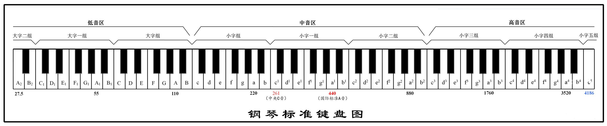
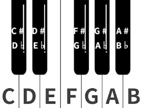
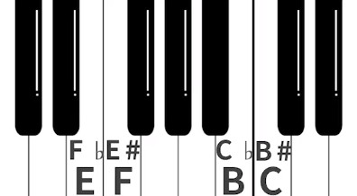
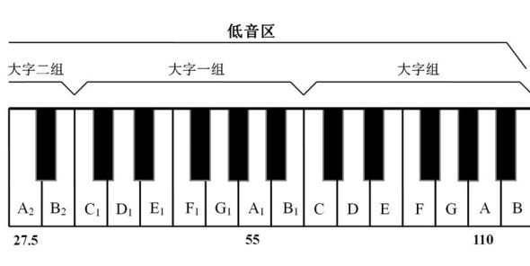
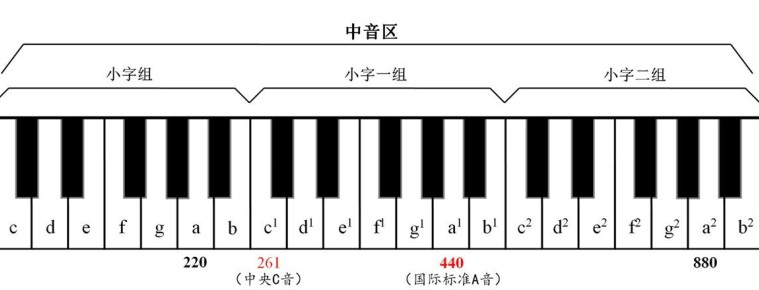
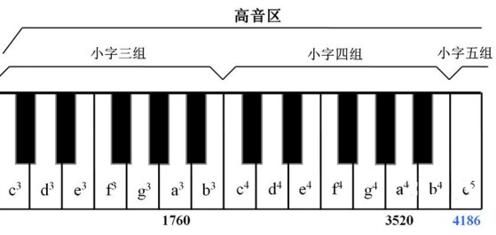
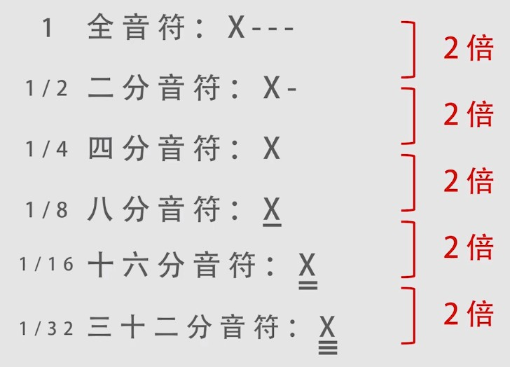
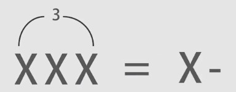
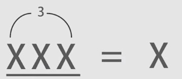
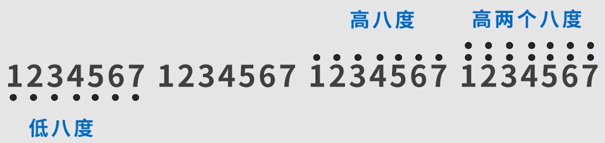

# 乐理

## 钢琴
- 总共88个键，去掉左侧3键，去掉右侧1键，如图所示：
  
- 可以划分为7组，每组有7个白键，5个黑键，一组键如图所示：  
  
- 左侧2个黑键挨一起，右侧3个黑键挨一起
- 从左到右键名(白键)依次是：`CDEFGAB`
- 从左到右音量依次升高
- 黑键没有键名，可以根据白键命名。例如`CD`之间的黑键，它位于`C`右侧，可以叫`C#`(C升)，但是它也位于`D`左侧，也可以叫`Db`(D降)

## 半音、全音、升音、降音、等音
- 半音：相邻的2个键，例如：`EF`、`BC`
- 全音：中间隔了1个键(黑键白键都算)，例如：`CD`、`DE`等
- 升音：用符号`♯`表示，一般用`#`表示，升1个半音
- 降音：用符号`♭`表示，一般用`b`表示，降1个半音
- 等音：降音或升音后，和其他键一样(白键)，例如：`E`=`Fb`、`F`=`E#`，如图所示：  
  

## 还原号、重(chong)升、重降
- 还原号：用符号`♮`表示，降音或升音的键，还原后，回到原有的键，例如：`C#`还原为`C`、`Db`还原为`D`、`E#`还原到`E`
- 重升：用符号`×`表示，一般用`x`表示，升2个半音(或1个全音)
- 重降：用符号`♭♭`表示，一般用`bb`表示，降2个半音(或1个全音)

## 键的命名
- 分为低、中、高音区，如图所示：
  - 低音区：  
  
  - 中音区：  
  
  - 高音区：  
  
- 低音区使用大写字母表示，从左到右分别为`大字二组`、`大字一组`、`大字组`
- 中、高音区使用小写字母表示，从左到右分别为`小字组`、`小字二组`、`小字三组`、`小字4组`、`小字五组`

## 音符时值
- 时值代表音的长短，值越大，时间越长
- 以`4分音符`为基础，长一倍后面加一个`-`，短一倍底部加一个`-`
- 如图所示：  
  

## 拍号、音符、小节
- 拍号：以分数的形式表示，最常见的是`4/4拍`，也叫`44拍`(第一个4是指分母，第二个4是指分子)，意思是`以4分音符为1拍，每小节有4拍`，`4分音符`是指分母，`4拍`是指分子
- 音符：一个发音数字叫1个音符，像`1234567`，用`X`表示通用音符
- 小节：乐谱中两条竖线`|`内的叫小节，例如：`|XXXX|`，里面有4个`4分音符`
- 以`4分音符为1拍`为例：`全音符`=`4拍`、`2分音符`=`2拍`、`4分音符`=`1拍`、`8分音符`=`1/2拍`、`16分音符`=`1/4拍`、`32分音符`=`1/8拍`
- 以`8分音符为1拍`为例：`全音符`=`8拍`、`2分音符`=`4拍`、`4分音符`=`2拍`、`8分音符`=`1拍`、`16分音符`=`1/2拍`、`32分音符`=`1/4拍`
- 常见的拍号：`44拍`、`43拍`、`42拍`、`83拍`、`86拍`

## 附点音符、三连音
- 附点音符：在音符后面加一个`·`，例如`X·`，表示该音符发音时间延长`1/2`
- 三连音：把一个整体切成3等分，例如：
  - 4分音符三连音：把2分音符作为一个整体切成3等分，如图所示：  
    
  - 8分音符三连音：把4分音符作为一个整体切成3等分，如图所示：  
    

## 拍号的强弱规律
- 2拍：强弱
- 3拍：强弱弱
- 4拍：强弱`次强`弱
- 6拍：强弱弱`次强`弱弱

## 歌曲速度(BPM)
- 每分钟节拍数的单位
- 60÷速度=1拍占用的时间(秒)
- 例如：`44拍`，`60BPM`，1拍占用1秒，用这个`4分音符`演奏1秒，即一小节占用4秒
- 例如：`86拍`，`120BPM`，1拍占用0.5秒，用这个`8分音符`演奏0.5秒，即一小节占用3秒

## 唱名与简谱数字
| 简谱 | 1   | 2   | 3   | 4   | 5   | 6   | 7   |
| ---- | --- | --- | --- | --- | --- | --- | --- |
| 唱名 | do  | re  | mi  | fa  | sol | la  | si  |

- 以指定简谱数字参考基础，右侧高8度，在数字顶部加一个点，左侧低8度，在数字底部加一个点，如图所示：
  

## 自然大调
- `C自然大调`(白键)：`1=C`，指明简谱`1`对应小字组中的音名`C`，即`CDFEGAB`=`1234567`，音阶为`CDFEGABC`
- 大调内部排列规律都是一样的为：`全全半全全全半`(助记：2131)
- 推导出`G大调`音阶为：`GABCDEF#G`，调式内的音名都要按顺序出现，如果`7`为`Gb`，那么就没有F音名了，所以只能是`F#`
- `D大调`音阶为：`DEF#GABC#D`
- 黑键也能作为调式，一般使用降调
- `#C调`音阶为：`C#D#F#E#G#A#B#C#`
- `bD调`音阶为：`DbEbFGbAbBbCDb`
- `#D调`音阶为：`D#E#FxG#A#B#CxD#`
- `bE调`音阶为：`EbFGAbBbCDEb`

## 自然小调
- `A自然小调`(白键)：音名与简谱对应关系为：`ABCDFEG`=`6712345`，音阶为`ABCDFEGA`
- 小调内部排列规律都是一样的为：`全半全全半全全`(助记：11212)

## 音程
- 2个音名之间的白键距离(包括自己)(单位：度)
- 如果音名是黑键，需要还原到白键
- 例如：`C`->`A`=`6度`、`C#`(还原到`C`)->`E`=`3度`、`Db`(还原到`D`)->`E`=`2度`

### 音程的属性(流行歌曲里90%的和声音程都是纯、大、小)
- 纯(谐音：你是我爸)
  - 1度 C到C
  - 4度 C到F 6个键(2个音名包含几个键(包括黑键、包括自己))
  - 5度 C到G 8个键
  - 8度 C到高音C
- 大
  - 2度 C到D 3个键
  - 3度 C到E 5个键
  - 6度 C到A 10个键
  - 7度 C到B 12个键
- 小(与大相比，少1个键)
  - 2度 3个键
  - 3度 5个键
  - 6度 10个键
  - 7度 12个键
- 减(①与纯相比，少1个键②与小相比，少1个键(与大相比，少2个键))
  - 4度 4个键
  - 5度 6个键
  - 2度 2个键
  - 3度 4个键
  - 6度 9个键
  - 7度 11个键
- 倍减(与减相比，少1个键)(①与纯相比，少2个键②与大相比，少3个键)
  - 4度 3个键
  - 5度 5个键
  - 2度 1个键
  - 3度 3个键
  - 6度 8个键
  - 7度 10个键
- 增(①与纯相比，多1个键②与大相比，多1个键)
  - 4度 C到F 7个键
  - 5度 C到G 9个键
  - 2度 C到D 4个键
  - 3度 C到E 6个键
  - 6度 C到A 11个键
  - 7度 C到B 13个键
- 倍增(与增相比，多1个键)(①与纯相比，多2个键②与大相比，多2个键)
  - 4度 C到F 8个键
  - 5度 C到G 10个键
  - 2度 C到D 5个键
  - 3度 C到E 7个键
  - 6度 C到A 12个键
  - 7度 C到B 14个键

## 音的乐名(以C大调为例)
| 乐名 | 主音 | 上主音 | 中音 | 下属音 | 属音 | 下中音 | 导音 |
| ---- | ---- | ------ | ---- | ------ | ---- | ------ | ---- |
| 音名 | C    | D      | E    | F      | G    | A      | B    |
| 唱名 | do   | re     | mi   | fa     | sol  | la     | si   |
| 简谱 | 1    | 2      | 3    | 4      | 5    | 6      | 7    |
