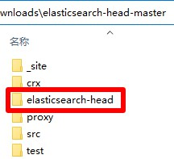

# ElasticSearchHead

## 下载

1. 下载地址 <https://github.com/mobz/elasticsearch-head> 点击右侧绿色按钮`Code`，选择`Download ZIP`选项，名称应为`elasticsearch-head-master.zip`，解压后文件夹名称应为`elasticsearch-head-master`
2. 快速下载地址 <https://github.com/mobz/elasticsearch-head/archive/refs/heads/master.zip>

## 初始化

1. 把本压缩包解压到`elasticsearch-head-master`文件夹内，如图所示：  

2. 双击`extra`文件夹里的`初始化.bat`文件

## 运行

1. 双击`ElasticSearchHead.bat`文件
2. 运行示例  

## 注意

1. 构建和运行都需要安装`node.js`，如果未安装，请到 <https://nodejs.org/zh-cn/> 下载并安装
2. 如果构建时提示无法下载`phantomjs-2.1.1-windows.zip`文件，可以到 <https://github.com/Medium/phantomjs/releases/download/v2.1.1/phantomjs-2.1.1-windows.zip> 下载并放到`C:\Users\用户名\AppData\Local\Temp\phantomjs`路径下(无需解压)，如果下载速度过慢，可以到 <https://lanzoui.com/iLj3psqyqfe> 下载

## 提示

1. 可以把`_site`文件夹复制到nginx里面运行
2. 可以双击`crx`文件夹里面的`es-head.crx`文件，安装到浏览器运行
3. 本服务无法跨域访问，如有需求，请使用提示1的方法

## 打包下载

1. 阿里云盘 <https://www.aliyundrive.com/s/JSqq7tgLvgK>
2. 天翼云盘 <https://cloud.189.cn/web/share?code=ZnYFvuqINV3q>
3. 百度网盘 <https://pan.baidu.com/s/19jzS-u2LhRGBn4L0KKIP3g> 提取码：8888

### 修改功能

1. 已构建

## 网站

1. 项目地址 <https://gitee.com/ALI1416/document/tree/master/program/elasticsearch-head>
2. 个人网站 <http://404z.cn>
3. GitHub <https://github.com/ALI1416>
4. Gitee <https://gitee.com/ALI1416>
