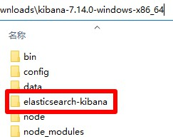
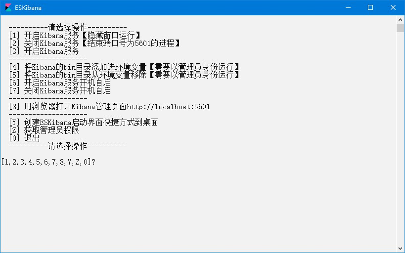

# ElasticSearchKibana

## 下载

1. 下载地址 <https://www.elastic.co/cn/downloads/kibana> 版本选择`WINDOWS`，名称应为`kibana-8.9.1-windows-x86_64.zip`，解压后文件夹名称应为`kibana-8.9.1-windows-x86_64`
2. 快速下载地址 <https://artifacts.elastic.co/downloads/kibana/kibana-8.9.1-windows-x86_64.zip> 版本号参考 <https://www.elastic.co/cn/downloads/past-releases#kibana>

## 初始化

1. 把本压缩包解压到`kibana-8.9.1-windows-x86_64`文件夹内，如图所示：  

2. 双击`extra`文件夹里的`初始化.bat`文件

## 运行

1. 双击`ElasticSearchKibana.bat`文件
2. 运行示例  


## 注意

1. ElasticSearch和Kibana版本号需要一致

## 提示

1. 启用跨域  
编辑`config/kibana.yml`，在尾部添加以下一行

```yml
server.host: "0.0.0.0"
```

## 打包下载

1. 天翼云盘 <https://cloud.189.cn/web/share?code=ZnYFvuqINV3q>

### 修改功能

1. 启用跨域

## 网站

1. 项目地址 <https://gitee.com/ALI1416/document/tree/master/program/elasticsearch-kibana>
2. 个人网站 <https://www.404z.cn>
3. GitHub <https://github.com/ALI1416>
4. Gitee <https://gitee.com/ALI1416>
