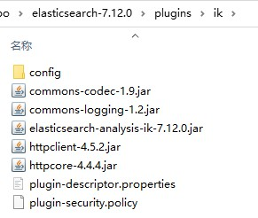
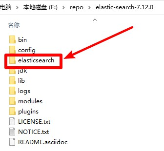

# ElasticSearch

## 下载
1. ElasticSearch压缩包，下载地址 https://www.elastic.co/cn/downloads/elasticsearch 版本选择`WINDOWS`，名称应为`elasticsearch-版本号-windows-x86_64.zip`，解压后文件夹名称应为`elasticsearch-版本号`
2. ElasticSearch-Analysis-IK压缩包，下载地址 https://github.com/medcl/elasticsearch-analysis-ik/releases/ 选择最新版，名称应为`elasticsearch-analysis-ik-版本号.zip`
3. 打开`elasticsearch-版本号`文件夹，进入`plugins`文件夹中，新建名称为`ik`的文件夹
4. 把`elasticsearch-analysis-ik-版本号.zip`解压到`ik`文件夹中，如图所示：  


## 初始化
1. 把本压缩包解压到`elasticsearch-版本号`文件夹内，如图所示：  

2. 双击`初始化.bat`文件

## 运行
双击`ES.bat`文件

## 注意
ElasticSearch和ElasticSearch-Analysis-IK版本号需要一致

## 提示
1. 调整占用内存  
   编辑`config\jvm.options`文件，在尾部添加以下两行
   ```properties
   -Xms2g
   -Xmx2g
   ```
   `-Xms2g`：最小占用内存为2g  
   `-Xmx2g`：最大占用内存为2g  
2. 启用跨域  
   编辑`config\elasticsearch.yml`，在尾部添加以下两行
   ```yml
   http.cors.enabled: true
   http.cors.allow-origin: "*"
   ```
   `http.cors.enabled: true`：启用跨域  
   `http.cors.allow-origin: "*"`：允许所有用户访问

## 打包下载
地址 https://cloud.189.cn/web/share?code=ZnYFvuqINV3q  
找到`elasticsearch-版本号.zip`进行下载  
修改功能：
1. 调整占用内存为2g
2. 启用跨域
