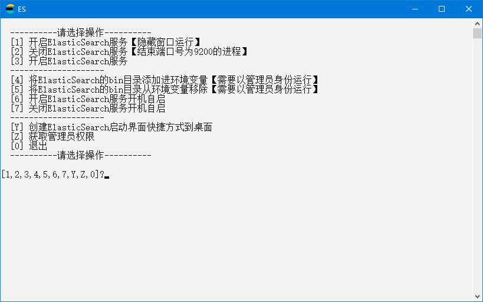

# ElasticSearch

## 下载

1. ElasticSearch压缩包，下载地址 <https://www.elastic.co/cn/downloads/elasticsearch> 版本选择`WINDOWS`，名称应为`elasticsearch-8.9.1-windows-x86_64.zip`，解压后文件夹名称应为`elasticsearch-8.9.1`
2. ElasticSearch-Analysis-IK压缩包，下载地址 <https://github.com/medcl/elasticsearch-analysis-ik/releases/> 选择最新版，名称应为`elasticsearch-analysis-ik-8.9.1.zip`
3. 打开`elasticsearch-8.9.1`文件夹，进入`plugins`文件夹中，新建名称为`ik`的文件夹
4. 把`elasticsearch-analysis-ik-8.9.1.zip`解压到`ik`文件夹中，如图所示：  

5. ElasticSearch压缩包，快速下载地址 <https://artifacts.elastic.co/downloads/elasticsearch/elasticsearch-8.9.1-windows-x86_64.zip> 版本号参考 <https://www.elastic.co/cn/downloads/past-releases#elasticsearch>
6. ElasticSearch-Analysis-IK压缩包，快速下载地址 <https://github.com/medcl/elasticsearch-analysis-ik/releases/download/v8.9.1/elasticsearch-analysis-ik-8.9.1.zip> 版本号参考ElasticSearch版本号，ElasticSearch-Analysis-IK更新速度可能比ElasticSearch慢

## 初始化

1. 把本压缩包解压到`elasticsearch-8.9.1`文件夹内，如图所示：  

2. 双击`extra`文件夹里的`初始化.bat`文件

## 运行

1. 双击`ElasticSearch.bat`文件
2. 运行示例  


## 注意

1. ElasticSearch和ElasticSearch-Analysis-IK版本号需要一致

## 提示

1. 调整占用内存  
编辑`config\jvm.options`文件，在尾部添加以下两行

```yml
-Xms512m
-Xmx512m
```

2. 启用跨域、外网访问  
编辑`config\elasticsearch.yml`，在尾部添加以下两行

```yml
http.cors.enabled: true
http.cors.allow-origin: "*"
node.name: node-1
network.host: 0.0.0.0
cluster.initial_master_nodes: ["node-1"]
```

3. 关闭账号密码访问  
编辑`config\elasticsearch.yml`，在尾部添加以下两行

```yml
xpack.security.enabled: false
```

4. 关闭SSL验证  
编辑`config\elasticsearch.yml`，在尾部添加以下两行

```yml
xpack.security.http.ssl.enabled: false
```

## 打包下载

1. 天翼云盘 <https://cloud.189.cn/web/share?code=ZnYFvuqINV3q>

### 修改功能

1. 附带ElasticSearch-Analysis-IK
2. 调整占用内存
3. 启用跨域、外网访问
4. 关闭账号密码访问
5. 关闭SSL验证

## 网站

1. 项目地址 <https://gitee.com/ALI1416/document/tree/master/program/elasticsearch>
2. 个人网站 <https://www.404z.cn>
3. GitHub <https://github.com/ALI1416>
4. Gitee <https://gitee.com/ALI1416>
