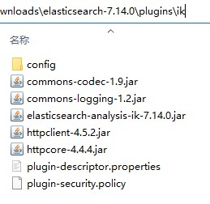

# ElasticSearch

## 安装
1. 下载ElasticSearch压缩包，地址 https://www.elastic.co/cn/downloads/elasticsearch 选择`WINDOWS`版本下载，名称应为`elasticsearch-版本号-windows-x86_64.zip`，并解压
2. 下载ElasticSearch-Analysis-IK压缩包，地址 https://www.elastic.co/cn/downloads/elasticsearch 选择最新版本下载，名称应为`elasticsearch-analysis-ik-版本号.zip`
3. 打开ElasticSearch压缩包解压后的文件夹，进入`plugins`文件夹中，新建名称为`ik`的文件夹
4. 把ElasticSearch-Analysis-IK压缩包解压到`ik`文件夹中，如图所示：  

5. 把本压缩包解压到刚才的ElasticSearch压缩包解压后的文件夹内，如图所示：  

6. 安装后，可以把`README.md`文件和`img`文件夹删除掉
7. 可以对安装后的文件夹进行打包(请不要运行`ElasticSearch.bat`文件)

## 运行
点击`ElasticSearch.bat`文件运行ElasticSearch启动界面

## 注意
ElasticSearch和ElasticSearch-Analysis-IK版本号需要一致

## 提示
1. 调整占用内存
编辑`config\jvm.options`文件，在尾部添加以下两行
```properties
-Xms2g
-Xmx2g
```
`-Xms2g`：最小占用内存为2g  
`-Xmx2g`：最大占用内存为2g  
2. 启用跨域
编辑`config\elasticsearch.yml`，在尾部添加以下两行
```yml
http.cors.enabled: true
http.cors.allow-origin: "*"
```
`http.cors.enabled: true`：启用跨域  
`http.cors.allow-origin: "*"`：允许所有用户访问
