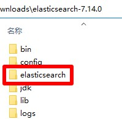

# ElasticSearch

## 下载
1. ElasticSearch压缩包，下载地址 https://www.elastic.co/cn/downloads/elasticsearch 版本选择`WINDOWS`，名称应为`elasticsearch-7.14.0-windows-x86_64.zip`，解压后文件夹名称应为`elasticsearch-7.14.0`
2. ElasticSearch-Analysis-IK压缩包，下载地址 https://github.com/medcl/elasticsearch-analysis-ik/releases/ 选择最新版，名称应为`elasticsearch-analysis-ik-7.14.0.zip`
3. 打开`elasticsearch-7.14.0`文件夹，进入`plugins`文件夹中，新建名称为`ik`的文件夹
4. 把`elasticsearch-analysis-ik-7.14.0.zip`解压到`ik`文件夹中，如图所示：  

5. ElasticSearch压缩包，快速下载地址 https://artifacts.elastic.co/downloads/elasticsearch/elasticsearch-7.14.0-windows-x86_64.zip 版本号参考 https://www.elastic.co/cn/downloads/past-releases#elasticsearch
6. ElasticSearch-Analysis-IK压缩包，快速下载地址 https://github.com/medcl/elasticsearch-analysis-ik/releases/download/v7.14.0/elasticsearch-analysis-ik-7.14.0.zip 版本号参考ElasticSearch版本号，ik插件更新速度可能比ElasticSearch慢

## 初始化
1. 把本压缩包解压到`elasticsearch-7.14.0`文件夹内，如图所示：  

2. 双击`初始化.bat`文件

## 运行
1. 双击`ES.bat`文件

## 注意
1. ElasticSearch和ElasticSearch-Analysis-IK版本号需要一致

## 提示
1. 调整占用内存  
   编辑`config\jvm.options`文件，在尾部添加以下两行
   ```properties
   -Xms2g
   -Xmx2g
   ```
   `-Xms2g`：最小占用内存为2g  
   `-Xmx2g`：最大占用内存为2g  
2. 启用跨域  
   编辑`config\elasticsearch.yml`，在尾部添加以下两行
   ```yml
   http.cors.enabled: true
   http.cors.allow-origin: "*"
   ```
   `http.cors.enabled: true`：启用跨域  
   `http.cors.allow-origin: "*"`：允许所有用户访问
3. 用户、角色、权限和密码  
   需要安装xpack插件(收费)，请搜索`elasticsearch xpack`

## 打包下载
1. 阿里云盘 https://www.aliyundrive.com/s/JSqq7tgLvgK
### 修改功能
1. 附带ik
2. 调整占用内存为2g
3. 启用跨域

## 网站
1. 项目地址 https://gitee.com/ALI1416/document/tree/master/program/elasticsearch
2. 个人网站 http://404z.cn
3. GitHub https://github.com/ALI1416
4. Gitee https://gitee.com/ALI1416
