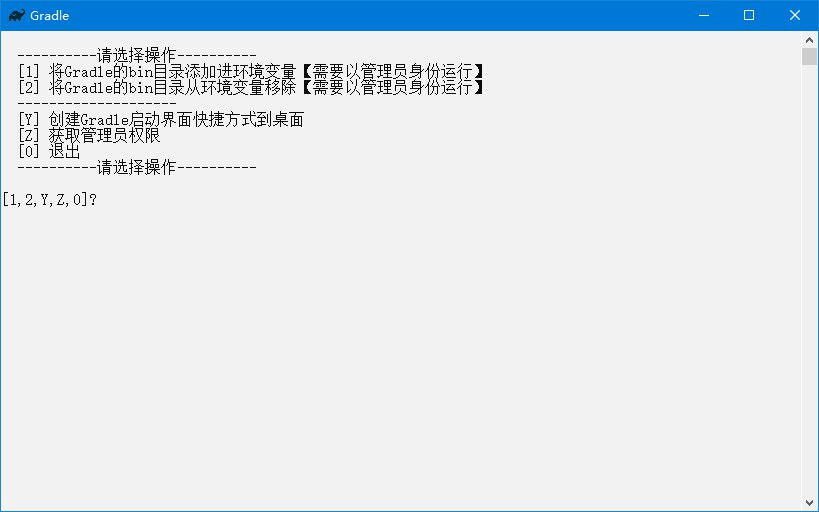

# Gradle

## 下载

1. 下载地址 <https://gradle.org/releases/> `Download`选择`binary-only`，名称应为`gradle-7.2-bin.zip`，解压后文件夹名称应为`gradle-7.2`
2. 快速下载地址 <https://downloads.gradle-dn.com/distributions/gradle-7.2-bin.zip> 版本号参考 <https://gradle.org/releases/>

## 初始化

1. 把本压缩包解压到`gradle-7.2`文件夹内，如图所示：  

2. 双击`extra`文件夹里的`初始化.bat`文件

## 运行

1. 双击`Gradle.bat`文件
2. 运行示例  


## 提示

1. 编译项目时，报`你的主机中的软件中止了一个已建立的连接。`错误，需要关闭电脑的`移动热点`
2. 使用idea运行gradle项目时，报`Error running 'ServiceStarter': Command line is too long. Shorten command line for ServiceStarter or also for Application default configuration.`错误，需要修改项目下`.idea\workspace.xml`文件，找到标签`<component name="PropertiesComponent">`，在标签里加一行`<property name="dynamic.classpath" value="true" />`
3. 仓库配置

   ```gradle
    allprojects {
        // 仓库配置
        repositories {
            // 本地仓库
            mavenLocal()
            // 私有仓库内网
    //        maven {
    //            url "http://192.168.2.102:8081/repository/maven-public/"
    //            allowInsecureProtocol true
    //        }
            // 公司私有仓库外网
    //        maven {
    //            url "http://192.168.18.248:8081/repository/maven-public/"
    //            allowInsecureProtocol true
    //        }
            // 阿里云仓库
            maven { url "https://maven.aliyun.com/repository/public" }
            // central仓库
            mavenCentral()
            // jitPack仓库
            maven { url "https://jitpack.io" }
        }
    }
   ```

## 打包下载

1. 阿里云盘 <https://www.aliyundrive.com/s/JSqq7tgLvgK>
2. 天翼云盘 <https://cloud.189.cn/web/share?code=ZnYFvuqINV3q>
3. 百度网盘 <https://pan.baidu.com/s/19jzS-u2LhRGBn4L0KKIP3g> 提取码：8888

## 网站

1. 项目地址 <https://gitee.com/ALI1416/document/tree/master/program/gradle>
2. 个人网站 <http://404z.cn>
3. GitHub <https://github.com/ALI1416>
4. Gitee <https://gitee.com/ALI1416>
