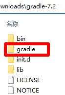

# Gradle

## 下载
1. 下载地址 https://gradle.org/releases/ Download选择`binary-only`，名称应为`gradle-7.2-bin.zip`，解压后文件夹名称应为`gradle-7.2`
2. 快速下载地址 https://downloads.gradle-dn.com/distributions/gradle-7.2-bin.zip 版本号参考 https://gradle.org/releases/

## 初始化
1. 把本压缩包解压到`gradle-7.2`文件夹内，如图所示：  

2. 双击`初始化.bat`文件

## 运行
1. 双击`Gradle.bat`文件

## 打包下载
1. 地址 https://cloud.189.cn/web/share?code=ZnYFvuqINV3q 找到`gradle-7.2`进行下载  
