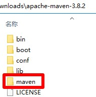
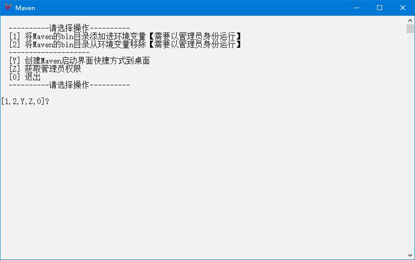

# Maven

## 下载

1. 下载地址 <https://maven.apache.org/download.cgi> `Files`标题下`Binary zip archive`版本选择`apache-maven-3.8.2-bin.zip`，名称应为`apache-maven-3.8.2-bin.zip`，解压后文件夹名称应为`apache-maven-3.8.2`
2. 快速下载地址 <https://mirrors.bfsu.edu.cn/apache/maven/maven-3/3.8.2/binaries/apache-maven-3.8.2-bin.zip> 版本号参考 <https://maven.apache.org/docs/history.html>

## 初始化

1. 把本压缩包解压到`apache-maven-3.8.2`文件夹内，如图所示：  

2. 双击`extra`文件夹里的`初始化.bat`文件

## 运行

1. 双击`Maven.bat`文件
2. 运行示例  

## 提示

1. Maven配置示例在[extra/settings.xml](extra/settings.xml)文件中
   1. 48行设置仓库在本地缓存的位置
   2. 112-116行设置发布到Maven仓库的账号和密码
   3. 152-157行设置远程镜像仓库为阿里云仓库
   4. 205-217行设置Maven使用Java版本为1.8

## 打包下载

1. 天翼云盘 <https://cloud.189.cn/web/share?code=ZnYFvuqINV3q>

## 网站

1. 项目地址 <https://gitee.com/ALI1416/document/tree/master/program/maven>
2. 个人网站 <http://404z.cn>
3. GitHub <https://github.com/ALI1416>
4. Gitee <https://gitee.com/ALI1416>
