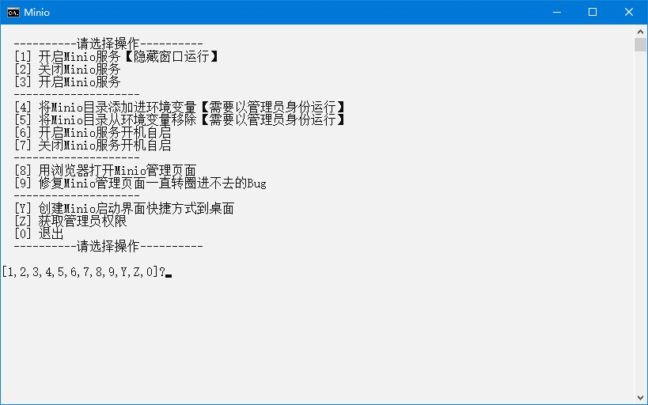

# Minio

## 下载

1. 下载地址 <https://min.io/download#/windows> 下载`MINIO 服务器`和`MINIO 客户端`，名称分别为`minio.exe`和`mc.exe`
2. `minio.exe`快速下载地址 <http://dl.min.io/server/minio/release/windows-amd64/minio.exe> 版本号参考 <https://dl.min.io/server/minio/release/windows-amd64/archive/>
3. `mc.exe`快速下载地址 <http://dl.min.io/client/mc/release/windows-amd64/mc.exe> 版本号参考 <https://dl.min.io/client/mc/release/windows-amd64/archive/>

## 初始化

1. 新建`bin`文件夹
2. 把下载好的`minio.exe`和`mc.exe`放到`bin`文件夹内
3. 双击`extra`文件夹里的`初始化.bat`文件

## 运行

1. 双击`Minio.bat`文件
2. 运行示例  


## 提示

1. 启用跨域  
   默认启用
2. 用户、角色、权限和密码  
   管理页面设置
3. 管理页面打开后一直转圈，浏览器控制台提示`Refused to execute script from 'xxxx' because its MIME type ('text/plain') is not executable, and strict MIME type checking is enabled.`，需要运行以下注册表文件：

   ```txt
   Windows Registry Editor Version 5.00

   [HKEY_CLASSES_ROOT\.js]
   "Content Type"="text/javascript"

   [HKEY_LOCAL_MACHINE\SOFTWARE\Classes\.js]
   "Content Type"="text/javascript"
   ```

## 打包下载

1. 天翼云盘 <https://cloud.189.cn/web/share?code=ZnYFvuqINV3q>

## 网站

1. 项目地址 <https://gitee.com/ALI1416/document/tree/master/program/minio>
2. 个人网站 <http://404z.cn>
3. GitHub <https://github.com/ALI1416>
4. Gitee <https://gitee.com/ALI1416>
