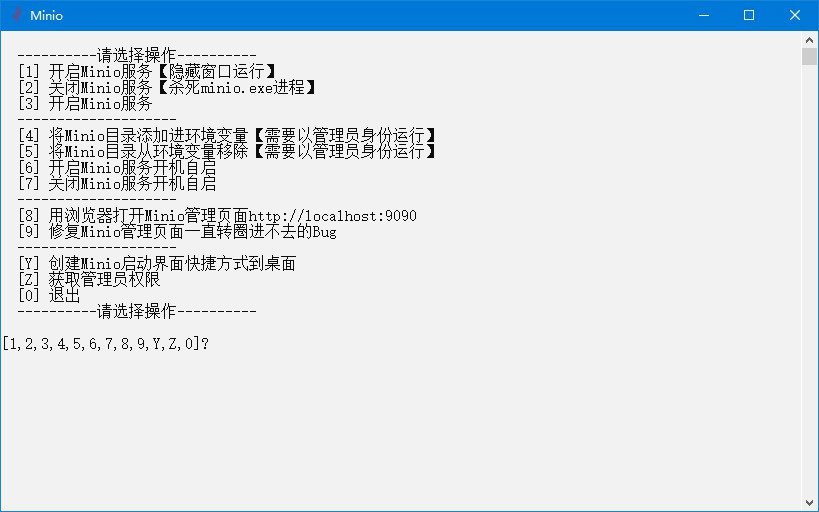

# Minio

## 下载
1. 下载地址 http://www.minio.org.cn/download.shtml#/windows 下载`MINIO 服务器`和`MINIO 客户端`，名称分别为`minio.exe`和`mc.exe`
2. `minio.exe`快速下载地址 http://dl.minio.org.cn/server/minio/release/windows-amd64/minio.exe
3. `mc.exe`快速下载地址 http://dl.minio.org.cn/client/mc/release/windows-amd64/mc.exe

## 初始化
1. 新建`bin`文件夹
2. 把下载好的`minio.exe`和`mc.exe`放到`bin`文件夹内
3. 双击`初始化.bat`文件

## 运行
1. 双击`Minio.bat`文件
2. 运行示例  


## 提示
1. 启用跨域  
   默认启用
2. 用户、角色、权限和密码  
   管理页面设置
3. 管理页面打开后一直转圈，浏览器控制台提示`Refused to execute script from 'xxxx' because its MIME type ('text/plain') is not executable, and strict MIME type checking is enabled.`，需要运行以下注册表文件：
   ```txt
   Windows Registry Editor Version 5.00

   [HKEY_CLASSES_ROOT\.js]
   "Content Type"="text/javascript"

   [HKEY_LOCAL_MACHINE\SOFTWARE\Classes\.js]
   "Content Type"="text/javascript"
   ```

## 打包下载
1. 阿里云盘 https://www.aliyundrive.com/s/JSqq7tgLvgK
2. 天翼云盘 https://cloud.189.cn/web/share?code=ZnYFvuqINV3q
3. 百度网盘 https://pan.baidu.com/s/19jzS-u2LhRGBn4L0KKIP3g 提取码：8888

## 网站
1. 项目地址 https://gitee.com/ALI1416/document/tree/master/program/minio
2. 个人网站 http://404z.cn
3. GitHub https://github.com/ALI1416
4. Gitee https://gitee.com/ALI1416
