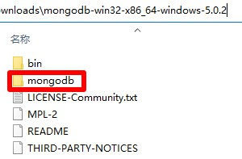

# MongoDB

## 下载
1. 下载地址 https://www.mongodb.com/try/download/community 版本选择`MongoDB Community Server`，Package选择`zip`，名称应为`mongodb-windows-x86_64-5.0.2.zip`，解压后文件夹名称应为`mongodb-win32-x86_64-windows-5.0.2`
2. 快速下载地址 https://fastdl.mongodb.org/windows/mongodb-windows-x86_64-5.0.2.zip 版本号参考 https://docs.mongodb.com/v5.0/release-notes/

## 初始化
1. 把本压缩包解压到`mongodb-win32-x86_64-windows-5.0.2`文件夹内，如图所示：  

2. 双击`初始化.bat`文件

## 运行
1. 双击`MongoDB.bat`文件

## 提示
1. 启用跨域  
   启动命令`mongod --dbpath "%~dp0bin\data" --bind_ip_all`中的`--bind_ip_all`参数是启用跨域
2. 用户、角色、权限和密码  
   数据库内设置

## 打包下载
1. 阿里云盘 https://www.aliyundrive.com/s/JSqq7tgLvgK
### 修改功能
1. 启用跨域

## 网站
1. 项目地址 https://gitee.com/ALI1416/document/tree/master/program/mongodb
2. 个人网站 http://404z.cn
3. GitHub https://github.com/ALI1416
4. Gitee https://gitee.com/ALI1416
