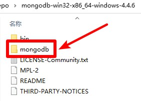

# MongoDB

## 提取
1. 下载MongoDB压缩包，地址 https://www.mongodb.com/try/download/community 选择`MongoDB Community Server`版本，`Package`选择`zip`下载，名称应为`mongodb-windows-x86_64-版本号.zip`，并解压
2. 把本压缩包解压到刚才的MongoDB压缩包解压后的文件夹内，如图所示：  

3. 双击`提取.bat`文件，进行文件提取
4. 提取后，可以把`README.md`文件、`提取.bat`文件和`img`文件夹删除掉
5. 可以对提取后的文件夹进行打包(请不要运行`MongoDB.bat`文件)

## 运行
点击`MongoDB.bat`文件运行MongoDB启动界面
