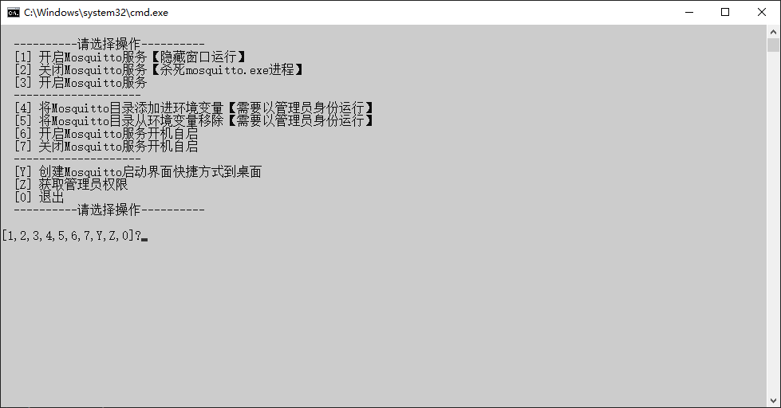

# Mosquitto

## 下载

1. 下载地址 <https://mosquitto.org/download/> 选择`Windows 64位`，名称应为`mosquitto-2.0.17-install-windows-x64.exe`，把后缀`exe`改成`zip`新建`mosquitto-2.0.17-install-windows-x64`文件夹并把文件解压进去
2. 快速下载地址 <https://mosquitto.org/files/binary/win64/mosquitto-2.0.17-install-windows-x64.exe> 版本号参考 <https://mosquitto.org/files/binary/win64/>

## 初始化

1. 把本压缩包解压到`mosquitto-2.0.17-install-windows-x64`文件夹内，如图所示：  

2. 双击`extra`文件夹里的`初始化.bat`文件

## 运行

1. 双击`Mosquitto.bat`文件
2. 运行示例  


## 提示

1. 开启外网匿名访问
   1. 找到安装目录，修改配置文件`mosquitto.conf`
   2. 新增以下内容

```conf
allow_anonymous true

listener 1883 0.0.0.0
protocol mqtt
socket_domain ipv4

listener 9001 0.0.0.0
protocol websockets
socket_domain ipv4
```

2. 添加用户名和密码
   1. 找到安装目录，配置文件`mosquitto.conf`新增一行`password_file D:\Program Files\mosquitto\pwfile.conf`
      1. 其中`D:\Program Files\mosquitto\pwfile.conf`是密码配置文件路径
   2. 在当前目录下打开`CMD`，输入`mosquitto_passwd -c pwfile.conf root`，再输入2次密码即可
      1. 其中`-c`是创建密码配置文件
      2. `pwfile.conf`是密码配置文件名
      3. `root`是创建的用户名

## 打包下载

1. 天翼云盘 <https://cloud.189.cn/web/share?code=ZnYFvuqINV3q>

### 修改功能

1. 开启外网匿名访问

## 网站

1. 项目地址 <https://gitee.com/ALI1416/document/tree/master/program/mosquitto>
2. 个人网站 <https://www.404z.cn>
3. GitHub <https://github.com/ALI1416>
4. Gitee <https://gitee.com/ALI1416>
