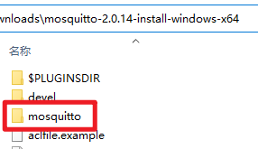

# Mosquitto

## 下载

1. 下载地址 <https://mosquitto.org/download/> 选择`Windows 64位`，名称应为`mosquitto-2.0.17-install-windows-x64.exe`，把后缀`exe`改成`zip`新建`mosquitto-2.0.17-install-windows-x64`文件夹并把文件解压进去
2. 快速下载地址 <https://mosquitto.org/files/binary/win64/mosquitto-2.0.17-install-windows-x64.exe> 版本号参考 <https://mosquitto.org/files/binary/win64/>

## 初始化

1. 把本压缩包解压到`mosquitto-2.0.17-install-windows-x64`文件夹内，如图所示：  

2. 双击`extra`文件夹里的`初始化.bat`文件

## 运行

1. 双击`Mosquitto.bat`文件
2. 运行示例  


## 提示

1. 开启外网匿名访问
   1. 找到安装目录，修改配置文件`mosquitto.conf`
   2. 新增以下内容

```conf
# 允许匿名访问
allow_anonymous true
# mqtt连接
listener 1883 0.0.0.0
protocol mqtt
socket_domain ipv4
# WebSocket连接
listener 15675 0.0.0.0
protocol websockets
socket_domain ipv4
```

2. 账号密码配置
   1. 找到安装目录，配置文件`mosquitto.conf`新增一行`password_file D:\Program Files\mosquitto\pwfile.conf`
      1. 其中`D:\Program Files\mosquitto\pwfile.conf`是密码配置文件路径
   2. 在当前目录下打开`CMD`，输入`mosquitto_passwd -c pwfile.conf root`，再输入2次密码即可
      1. 其中`-c`是创建密码配置文件
      2. `pwfile.conf`是密码配置文件名
      3. `root`是创建的账号
   3. 如果允许匿名访问，不输入账号密码也能连接成功

3. SSL配置
   1. 使用OpenSSL生成CA、server证书
   2. 添加以下配置文件
   3. 连接的时候提供CA证书、client证书和私钥即可，不需要账号密码

```conf
listener 8883 0.0.0.0
# 需要证书(false自动分配证书)
require_certificate true
# 单(false)双(true)向验证
use_identity_as_username true
# CA证书路径
cafile D:\Program Files\mosquitto\cert\ca.crt
# server证书路径
certfile D:\Program Files\mosquitto\cert\server.crt
# server私钥路径
keyfile D:\Program Files\mosquitto\cert\server.key
```

## 打包下载

1. 天翼云盘 <https://cloud.189.cn/web/share?code=ZnYFvuqINV3q>

### 修改功能

1. 开启外网匿名访问

## 网站

1. 项目地址 <https://gitee.com/ALI1416/document/tree/master/program/mosquitto>
2. 个人网站 <https://www.404z.cn>
3. GitHub <https://github.com/ALI1416>
4. Gitee <https://gitee.com/ALI1416>
