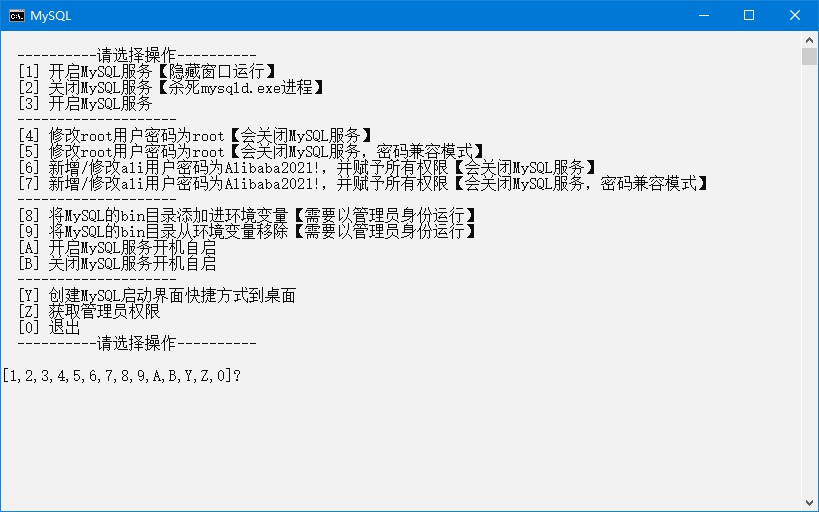

# MySQL

## 下载

1. 下载地址 <https://dev.mysql.com/downloads/mysql/> 版本选择`Windows (x86, 64-bit), ZIP Archive`，名称应为`mysql-8.0.26-winx64.zip`，解压后文件夹名称应为`mysql-8.0.26-winx64`
2. 快速下载地址 <https://dev.mysql.com/get/Downloads/MySQL-8.0/mysql-8.0.26-winx64.zip> 版本号参考 <https://downloads.mysql.com/archives/community/>

## 初始化

1. 把本压缩包解压到`mysql-8.0.26-winx64`文件夹内，如图所示：  

2. 双击`extra`文件夹里的`初始化.bat`文件

## 运行

1. 双击`MySQL.bat`文件
2. 运行示例  

## 提示

1. 跨域、用户、角色、权限和密码  
   数据库内设置
2. MySQL配置文件示例：[extra/my.ini](extra/my.ini)

## 注意

1. 如果提示`丢失xxx.dll文件`，需要安装`微软常用运行库`，可以到 <https://www.ghxi.com/yxkhj.html> 进行下载安装

## 打包下载

1. 天翼云盘 <https://cloud.189.cn/web/share?code=ZnYFvuqINV3q>

### 修改功能

1. `my.ini`使用MySQL配置文件示例：[extra/my.ini](extra/my.ini)

## 网站

1. 项目地址 <https://gitee.com/ALI1416/document/tree/master/program/mysql>
2. 个人网站 <http://404z.cn>
3. GitHub <https://github.com/ALI1416>
4. Gitee <https://gitee.com/ALI1416>
