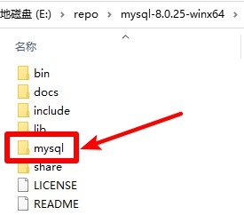

# MySQL

## 提取
1. 下载MySQL压缩包，地址 https://dev.mysql.com/downloads/mysql/ 选择`Windows (x86, 64-bit), ZIP Archive`版本下载，名称应为`mysql-版本号-winx64.zip`，并解压
2. 把本压缩包解压到刚才的MySQL压缩包解压后的文件夹内，如图所示：  

3. 双击`提取.bat`文件，进行文件提取
4. 提取后，可以把`README.md`文件、`提取.bat`文件和`img`文件夹删除掉
5. 可以对提取后的文件夹进行打包(请不要运行`MySQL.bat`文件)

## 运行
点击`MySQL.bat`文件运行MySQL启动界面
