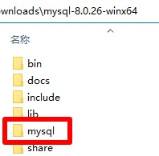

# MySQL

## 下载
下载地址 https://dev.mysql.com/downloads/mysql/ 版本选择`Windows (x86, 64-bit), ZIP Archive`，名称应为`mysql-版本号-winx64.zip`，解压后文件夹名称应为`mysql-版本号-winx64`

## 初始化
1. 把本压缩包解压到`mysql-版本号-winx64`文件夹内，如图所示：  

2. 双击`初始化.bat`文件

## 运行
双击`MySQL.bat`文件

## 注意
如果提示`丢失xxx.dll文件`，需要安装`微软常用运行库`，可以到 https://www.ghxi.com/yxkhj.html 进行下载安装
