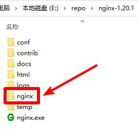
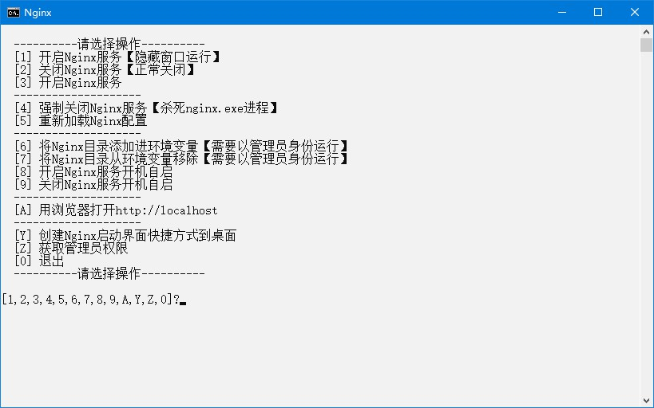

# Nginx

## 下载

1. 下载地址 <http://nginx.org/en/download.html> `Stable version`选择`nginx/Windows-1.20.1`，名称应为`nginx-1.20.1.zip`，解压后文件夹名称应为`nginx-1.20.1`
2. 快速下载地址 <http://nginx.org/download/nginx-1.20.1.zip> 版本号参考 <http://nginx.org/en/download.html>

## 初始化

1. 把本压缩包解压到`nginx-1.20.1`文件夹内，如图所示：  

2. 双击`extra`文件夹里的`初始化.bat`文件

## 运行

1. 双击`Nginx.bat`文件
2. 运行示例  

## 提示

1. Nginx配置文件示例：[extra/nginx.conf](extra/nginx.conf)

## 打包下载

1. 阿里云盘 <https://www.aliyundrive.com/s/JSqq7tgLvgK>
2. 天翼云盘 <https://cloud.189.cn/web/share?code=ZnYFvuqINV3q>
3. 百度网盘 <https://pan.baidu.com/s/19jzS-u2LhRGBn4L0KKIP3g> 提取码：8888

### 修改功能

1. `nginx.conf`使用Nginx配置文件示例：[extra/nginx.conf](extra/nginx.conf)

## 网站

1. 项目地址 <https://gitee.com/ALI1416/document/tree/master/program/nginx>
2. 个人网站 <http://404z.cn>
3. GitHub <https://github.com/ALI1416>
4. Gitee <https://gitee.com/ALI1416>
