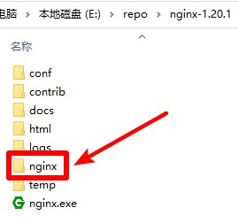

# Nginx

## 提取
1. 下载Nginx压缩包，地址 http://nginx.org/en/download.html 选择`Stable version`版本的`nginx/Windows-版本号`下载，名称应为`nginx-版本号.zip`，并解压
2. 把本压缩包解压到刚才的Nginx压缩包解压后的文件夹内，如图所示：  

3. 双击`提取.bat`文件，进行文件提取
4. 提取后，可以把`README.md`文件、`提取.bat`文件和`img`文件夹删除掉
5. 可以对提取后的文件夹进行打包(请不要运行`Nginx.bat`文件)

## 运行
点击`Nginx.bat`文件运行Nginx启动界面
