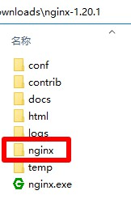

# Nginx

## 下载
1. 下载地址 http://nginx.org/en/download.html Stable version选择`nginx/Windows-1.20.1`，名称应为`nginx-1.20.1.zip`，解压后文件夹名称应为`nginx-1.20.1`
2. 快速下载地址 http://nginx.org/download/nginx-1.20.1.zip 版本号参考 http://nginx.org/en/download.html

## 初始化
1. 把本压缩包解压到`nginx-1.20.1`文件夹内，如图所示：  

2. 双击`初始化.bat`文件

## 运行
1. 双击`Nginx.bat`文件

## 打包下载
1. 地址 https://cloud.189.cn/web/share?code=ZnYFvuqINV3q 找到`nginx-1.20.1.zip`进行下载  
