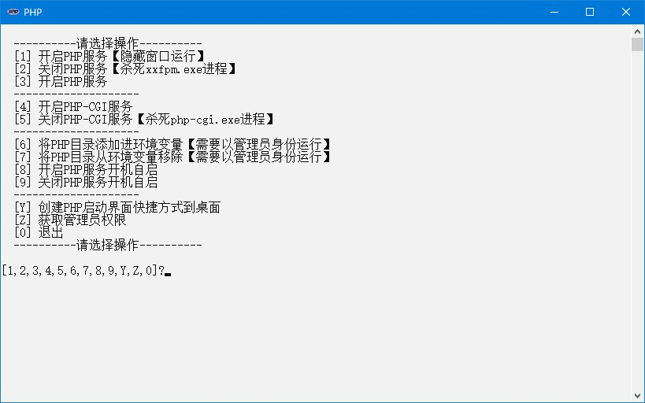

# PHP

## 下载

1. 下载地址 <https://windows.php.net/download/> `VS16 x64 Non Thread Safe`选择`Zip`，名称应为`php-8.0.11-nts-Win32-vs16-x64.zip`，，新建`php-8.0.11-nts-Win32-vs16-x64`文件夹并把文件解压进去
2. 快速下载地址 <https://windows.php.net/downloads/releases/php-8.0.11-nts-Win32-vs16-x64.zip> 版本号参考 <https://windows.php.net/downloads/releases/archives/>

## 初始化

1. 把本压缩包解压到`php-8.0.11-nts-Win32-vs16-x64`文件夹内，如图所示：  

2. 双击`extra`文件夹里的`初始化.bat`文件

## 运行

1. 双击`PHP.bat`文件
2. 运行示例  


## 提示

1. 直接启动php-cgi运行一段时间后可能会自动退出，需要使用xxfpm来维持php-cgi进程的数量，启动方式如下：

   ```dos
   xxfpm php-cgi -n 3 -p 9000
   ```

   - `-n 3`：启动3个php-cgi进程
   - `-p 9000`：启动端口号为9000
2. 整合nginx
   打开`nginx`安装路径下`conf`文件夹下的`nginx.conf`配置文件，在`server`下新增以下内容

   ```ini
   location ~ \.php$ {
       root           html;
       fastcgi_pass   127.0.0.1:9000;
       fastcgi_index  index.php;
       fastcgi_param  SCRIPT_FILENAME  $document_root$fastcgi_script_name;
       include        fastcgi_params;
    }
   ```

3. 启用插件
   修改`bin\php.ini`文件，把`;extension_dir = "ext"`改成`extension_dir = "ext"`
4. 启用mysqli插件
   修改`bin\php.ini`文件，把`;extension=mysqli`改成`extension=mysqli`
5. 启用openssl插件
   修改`bin\php.ini`文件，把`;extension=openssl`改成`extension=openssl`
6. 测试
   在nginx的html目录里新建一个`1.php`的文件，输入以下内容

   ```php
   <?php phpinfo();?>
   ```

   浏览器可以正常访问`http://localhost/1.php`说明启动成功

## 打包下载

1. 阿里云盘 <https://www.aliyundrive.com/s/JSqq7tgLvgK>
2. 天翼云盘 <https://cloud.189.cn/web/share?code=ZnYFvuqINV3q>
3. 百度网盘 <https://pan.baidu.com/s/19jzS-u2LhRGBn4L0KKIP3g> 提取码：8888

### 修改功能

1. 使用xxfpm来维持php-cgi进程的数量
2. 启用mysqli插件
3. 启用openssl插件

## 网站

1. 项目地址 <https://gitee.com/ALI1416/document/tree/master/program/php>
2. 个人网站 <http://404z.cn>
3. GitHub <https://github.com/ALI1416>
4. Gitee <https://gitee.com/ALI1416>
