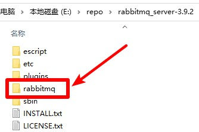

# RabbitMQ

## 提取
1. 下载RabbitMQ压缩包，地址 https://github.com/rabbitmq/rabbitmq-server/releases 选择最新版本下载，名称应为`rabbitmq-server-windows-版本号.zip`，并解压
2. 把本压缩包解压到刚才的RabbitMQ压缩包解压后的文件夹内，如图所示：  

3. 双击`提取.bat`文件，进行文件提取
4. 提取后，可以把`README.md`文件、`提取.bat`文件和`img`文件夹删除掉
5. 可以对提取后的文件夹进行打包(请不要运行`RabbitMQ.bat`文件)

## 运行
点击`RabbitMQ.bat`文件运行RabbitMQ启动界面

## 注意
运行RabbitMQ服务需要安装`erlang`，如果未安装，请到 https://www.erlang.org/downloads 下载并安装
