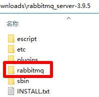
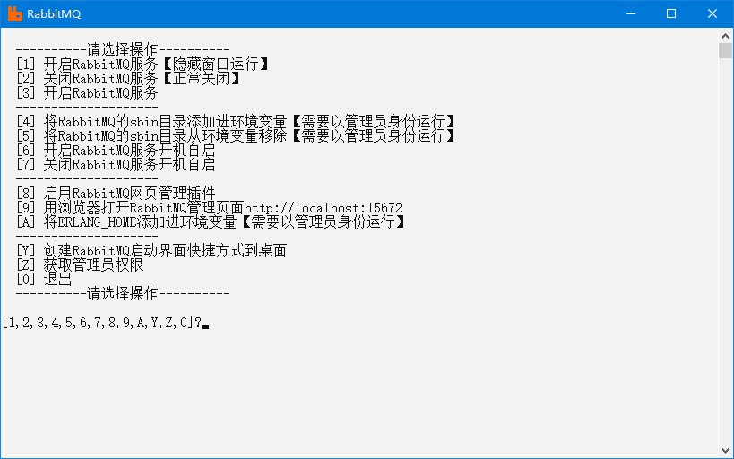

# RabbitMQ

## 下载
1. 下载地址 https://github.com/rabbitmq/rabbitmq-server/releases 选择最新版，名称应为`rabbitmq-server-windows-3.9.5.zip`，解压后文件夹名称应为`rabbitmq_server-3.9.5`
2. 快速下载地址 https://github.com/rabbitmq/rabbitmq-server/releases/download/v3.9.5/rabbitmq-server-windows-3.9.5.zip 版本号参考 https://www.rabbitmq.com/changelog.html

## 初始化
1. 把本压缩包解压到`rabbitmq_server-3.9.5`文件夹内，如图所示：  

2. 双击`初始化.bat`文件

## 运行
1. 双击`RabbitMQ.bat`文件
2. 运行示例  


## 注意
1. 运行RabbitMQ服务需要安装`erlang`，如果未安装，请到 https://www.erlang.org/downloads 下载并安装

## 提示
1. RabbitMQ配置文件示例在[extra/rabbitmq.config.example](extra/rabbitmq.config.example)
2. 启用跨域  
   新建或编辑`C:\Users\用户名\AppData\Roaming\RabbitMQ\rabbitmq.config`文件，插入以下内容
   ```js
   [{rabbit, [{loopback_users, []}]}].
   ```
3. 用户、角色、权限和密码  
   管理页面设置

## 打包下载
1. 阿里云盘 https://www.aliyundrive.com/s/JSqq7tgLvgK
2. 天翼云盘 https://cloud.189.cn/web/share?code=ZnYFvuqINV3q
3. 百度网盘 https://pan.baidu.com/s/19jzS-u2LhRGBn4L0KKIP3g 提取码：8888
### 修改功能
1. 启用跨域

## 网站
1. 项目地址 https://gitee.com/ALI1416/document/tree/master/program/rabbitmq
2. 个人网站 http://404z.cn
3. GitHub https://github.com/ALI1416
4. Gitee https://gitee.com/ALI1416
