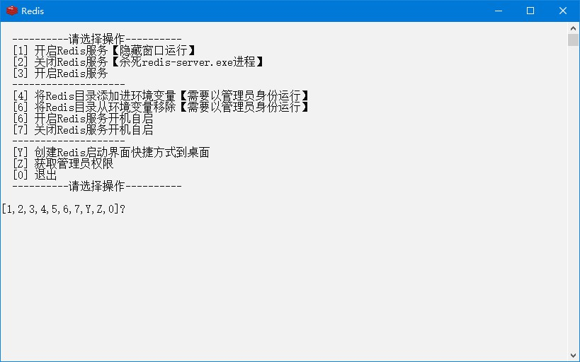

# Redis

## 下载

1. 下载地址 <https://github.com/tporadowski/redis/releases> 版本选择最新版，名称应为`Redis-x64-5.0.10.zip`，新建`Redis-x64-5.0.10`文件夹并把文件解压进去
2. 快速下载地址 <https://github.com/tporadowski/redis/releases/download/v5.0.10/Redis-x64-5.0.10.zip> 版本号参考 <https://github.com/tporadowski/redis/tags>

## 初始化

1. 把本压缩包解压到`Redis-x64-5.0.10`文件夹内，如图所示：  

2. 双击`extra`文件夹里的`初始化.bat`文件

## 运行

1. 双击`Redis.bat`文件
2. 运行示例  


## 提示

1. 启用跨域  
   编辑`redis.conf`文件  
   1. `bind 127.0.0.1`改成`bind 0.0.0.0`  
   2. `protected-mode yes`改成`protected-mode no`
2. 设置密码  
   编辑`redis.conf`文件，在尾部添加以下一行

   ```yml
   requirepass Alibaba2021!
   ```

## 打包下载

1. 阿里云盘 <https://www.aliyundrive.com/s/JSqq7tgLvgK>
2. 天翼云盘 <https://cloud.189.cn/web/share?code=ZnYFvuqINV3q>
3. 百度网盘 <https://pan.baidu.com/s/19jzS-u2LhRGBn4L0KKIP3g> 提取码：8888

### 修改功能

1. 启用跨域

## 网站

1. 项目地址 <https://gitee.com/ALI1416/document/tree/master/program/redis>
2. 个人网站 <http://404z.cn>
3. GitHub <https://github.com/ALI1416>
4. Gitee <https://gitee.com/ALI1416>
