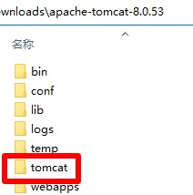
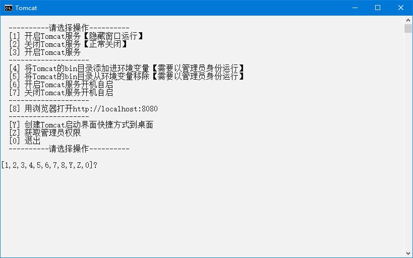

# Tomcat

## 下载

1. 下载地址 <https://archive.apache.org/dist/tomcat/> 选择要下载的大版本号，例如`tomcat-8`，再选择小版本号，例如`v8.0.53`，再进入`bin`目录，选择`apache-tomcat-8.0.53-windows-x64.zip`下载，解压后文件夹名称应为`apache-tomcat-8.0.53`，版本号参考 <https://tomcat.apache.org/whichversion.html> ，建议使用`8.0.53`，这是8.0版本的最后一版，高于8.0的可能会有莫名其妙的问题
2. 快速下载地址 <https://archive.apache.org/dist/tomcat/tomcat-8/v8.0.53/bin/apache-tomcat-8.0.53-windows-x64.zip>

## 初始化

1. 把本压缩包解压到`apache-tomcat-8.0.53`文件夹内，如图所示：  

2. 双击`extra`文件夹里的`初始化.bat`文件

## 运行

1. 双击`Tomcat.bat`文件
2. 运行示例  


## 提示

1. 修改端口号  
编辑`conf\server.xml`文件，搜索`8080`，找到

```xml
<Connector port="8080" protocol="HTTP/1.1"
         connectionTimeout="20000"
         redirectPort="8443" />
```

## 打包下载

1. 天翼云盘 <https://cloud.189.cn/web/share?code=ZnYFvuqINV3q>

## 网站

1. 项目地址 <https://gitee.com/ALI1416/document/tree/master/program/tomcat>
2. 个人网站 <https://www.404z.cn>
3. GitHub <https://github.com/ALI1416>
4. Gitee <https://gitee.com/ALI1416>
